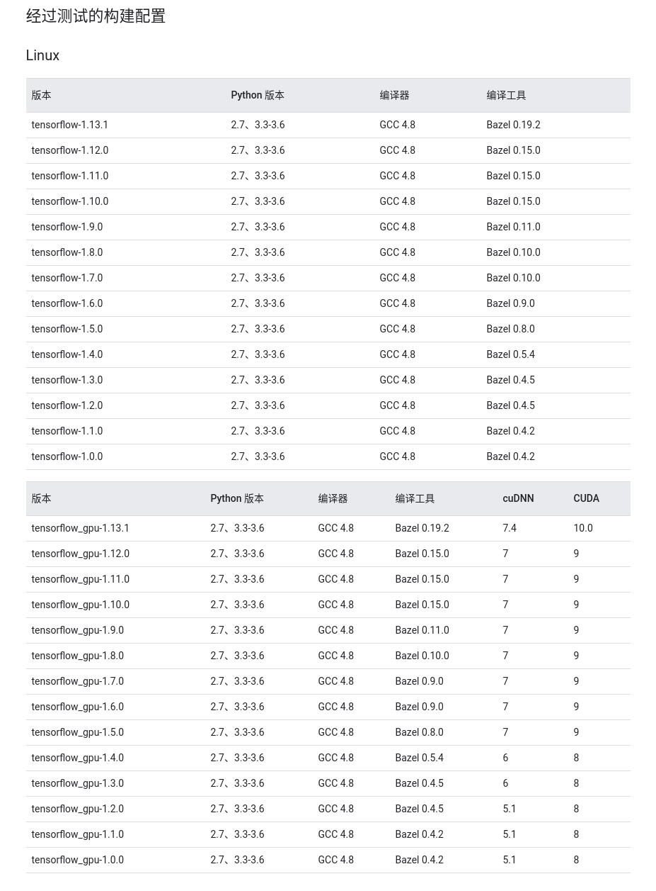

## GPU加速版TensorFlow安装踩坑记录

System information:

- Ubuntu 18.04 LTS

- TensorFlow version: 1.13

- Python version: 3.6

- CUDA: 10.0

- cuDNN: 7.4

- GPU: Nvidia GeForce GTX 1050

  

1. 千万提前确定好需要使用的tensorflow版本，再下载版本匹配的CUDA, cuDNN

   幸好TensorFlow已经帮我们测试好了，在官网可以轻松找到推荐的[构建配置](<https://www.tensorflow.org/install/source#tested_build_configurations>)。因为我平时都在用Ubuntu18.04，在这把Linux平台上合适的配置放出来

   

2. 确定好构建配置，这一步可以[下载CUDA](<https://developer.nvidia.com/cuda-toolkit-archive>)和[cuDNN](<https://developer.nvidia.com/rdp/cudnn-archive>)了

   CUDA安装指令在官网已经详细贴出来，我就不再重复（真正的坑在安装cuDNN的时候等着呢）

   [安装cuDNN](<https://docs.nvidia.com/deeplearning/sdk/cudnn-install/index.html#installlinux>)（这里还是以Linux平台为例）：

   - 下载cuDNN需要先注册

   - 解压tar包，先修改tar包文件权限

     `$sudo chmod +x cudnn-10.0-linux-x64-v7.4.2.tgz`

     `$tar -xzvf cudnn-10.0-linux-x64-v7.4.2.24.tgz`

   - 复制下列文件到CUDA Toolkit的文件夹，修改这些文件权限

     一般CUDA Toolkit会自动安装在`/usr/local`下面

     `$sudo cp cuda/include/cudnn.h /usr/local/cuda/include`

     `$sudo cp cuda/lib64/libcudnn* /usr/local/cuda/lib64`

     `$sudo chmod a+r /usr/local/cuda/include/cudnn.h /usr/local/cuda/lib64/libcudnn*`

3. 全部安装好后，检查版本是否正确

   - CUDA版本

     `$cat /usr/local/cuda/version.txt` 或者`nvcc --version`

   - cuDNN版本

     `$cat /usr/local/cuda/include/cudnn.h | grep CUDNN_MAJOR -A 2`

     ps: 有时候遇到`failed call to cuInit: CUDA_ERROR_UNKNOWN: unknown error`需要重启电脑

4. 最后的最后，检查TensorFlow是否能使用GPU加速

   ```python3
   from tensorflow.python.client import device_lib
   import tensorflow as tf
   
   
   # list the avilable devices in local processes
   device_lib.list_local_devices()
   
   # matrix multiplying with GPU
   a = tf.constant([1.0, 2.0, 3.0, 4.0, 5.0, 6.0], shape=[2, 3], name='a')
   b = tf.constant([1.0, 2.0, 3.0, 4.0, 5.0, 6.0], shape=[3, 2], name='b')
   c = tf.matmul(a, b)
   
   sess = tf.Session(config=tf.ConfigProto(log_device_placement=True))
   print(sess.run(c))
   ```

   