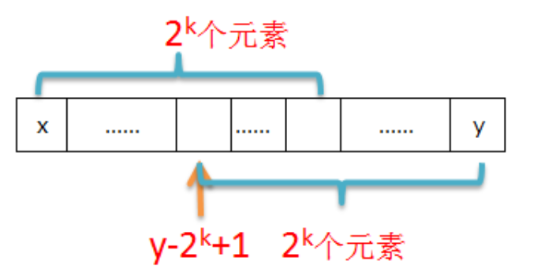

# Range Minimum/Maximum Query (RMQ)

RMQ对于给定长度n的数列A，询问区间数列A在（i,j）内最大最小值。

解决方法：（A长度为n，q次查询）

1. 搜索	复杂度：O(n) - O(qn)
2. 线段树   预处理：O(n) - 查询：O(qlogn)
3. Sparse table(ST) 预处理：O(nlogn) - 查询：O(q)


## ST算法

ST本质上是动态规划，适用的情况是数据不更新，因为更新需要重新建表，这种情况下就选择线段树啦。

复杂度：建表O(nlogn)，查询O(1)

### 预处理

`f[i][j]`保存每一块[i, i + $2^j$ - 1]的最大值，起点i、终点i + $2^j$ - 1共$2^j$个数

[i, i + $2^j$ - 1]可以拆分成等长的2块，[i, i + $2^{j-1}$ - 1]和[i + $2^{j-1}$, i + $2^j$ - 1]，递归结构显现，可以用DP啦

`f[i][j]=max(f[i][j - 1], f[i + (1<<(j-1))][j - 1])`

```java
// j上限设为20
for (int j = 1; j < 20; j++) {
    for (int i = 0; i + (1<<(j-1)) <= size; i++) {
        dp[i][j] = Math.max(dp[i][j - 1], dp[i + (1<<(j-1))][j - 1]);
    }
}
```

`dp[i][0]`记录的是原来数组的值，`i`从1开始是为了query时候方便，不用再改写成从0开始的index

### Query

[l, r]区间可以按照[i, i + $2^j$ - 1]的模式划分成2块，[l, l + $2^k$ - 1]和[r - $2^k$ + 1, r]，

其中k = $\lfloor log_2(r - l + 1)\rfloor$ 向下取整



2段小区间长度相等，记为len，证明小区间有重叠：

$\lfloor log_2(len)\rfloor$ >= $log_2(len)$ - 1，所以$2^{\lfloor log_2(len)\rfloor}$ >= len/2, 这样2段小区间便有了重叠，保证query操作的正确性

```java
public int query(int l, int r) {
    int k = (int) (Math.log(r - l + 1) / Math.log(2));
    return Math.max(dp[l][k], dp[r - (1<<k) + 1][k]);
}
```

