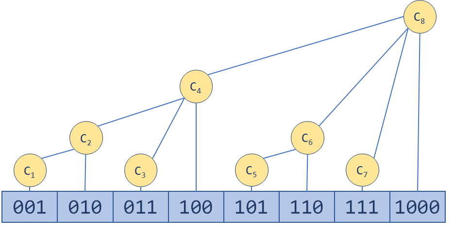
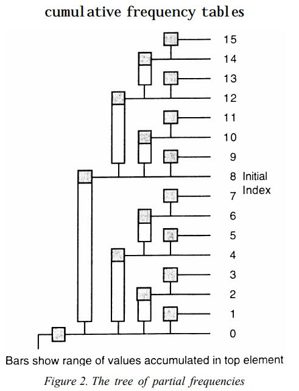
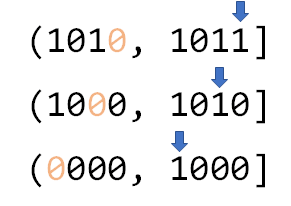
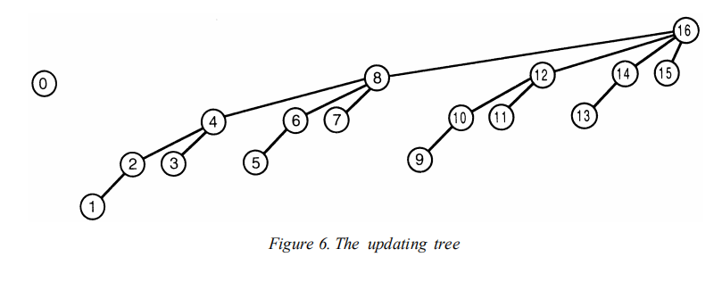
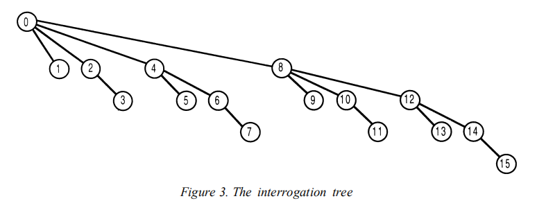

# Binary Indexed Tree

树状数组（或者直译过来就是：二进制下标树）支持两种操作，时间复杂度均为$O(logn)$

- 单点修改：更改数组中的一个元素的值
- 区间查询：查询一个区间内所有元素的和

先放个图，直观感受一下树状数组如何维护数据的



可以看到，树状数组（以下简称BIT）里的$C_i$维护一个小区间。BIT选择的维护的区间长度和i的二进制表示息息相关，从而做到了查询和修改的复杂度都在O(logn)内。借用BIT原始论文中的图来展示数组的$C_i$对应原始数组的哪些项，可以看到一个竖条对应一个$C_{i}$维护的区间，竖条顶端的阴影方块对应的数字就是这个区间累加和存在BIT中相应的下标。



BIT巧妙利用了二进制的表示。例如查询前11项和query(11)，这在BIT中是如何判断该合并那些区间来输出前11项的和呢？先看11的二进制表示$(1011)_2$，在BIT中前11项的和由$((0000)_2, (1000)_2]$，$((1000)_2, (1010)_2]$，$((1010)_2, (1011)_2]$这些区间组成，其中奥秘如下图：



区间下标的变化：**不断移出二进制下标最低位的1**

求二进制最右边的1到末尾的大小（最右边的1和之后的0组成的数字），这里用到了补码的知识。对于$(1011)_2$，先取反得到$(0100)_2$，再加1变成$(0101)_2$，再和原数相加，1011 & 0100，最后得到$(0011)_2$。其中，取反加一，根据补码的知识，可以通过语言中整数取相反数得到。

**lowbit的实现**

```java
public int lowbit(int x) {
    return (x & -x);
}
```


## 单点修改

那么更新过程如同在“爬树”，从更新的index沿着下图中的树型结构向ancestor爬，知道超出数组界限。顺便说明一下，树状数组的下标从1开始，tree[0]是不存东西的。比如，原始数组中的3这个位置的数据更新了，那么相应的3->4->8->...都需要更新，正好每次向上爬的index加的正是lowbit(x)



```java
public void update(int i, int inc) {
	/*
	* @param inc increment value for i-th array item
	*/
	while (i <= MAX_N) {
        tree[i] += inc;
        i += lowbit(i);
    }
}
```


## 区间查询

区间和的查询过程也有一个树型结构。比如查询前11项的和，初始n=11，沿着树向上，11->10->8->0到0为止，前11项的和=BIT[11] + BIT[10] + BIT[8]。这和之前讲lowbit函数，解释树状数组中区间的下标变化，是一样的过程。



**前n项前缀和**

```java
public int query(int n) {
    /*
    * @return the sum of first n items
    */
    int sum = 0;
    while (n > 0) {
        sum += tree[n];
        n -= lowbit(n);
    }
    return sum;
}
```


**区间查询**

```java
public int query(int l, int r) {
    /*
    * query range sum begins at the specified index l and extends to the index r,
    * range length is (r - l + 1)
    */
    return (query(r) - query(l - 1));
}
```


有趣的是，树状数组还可以求逆序对，见**（洛谷P1908）逆序对**

## Reference

[算法学习笔记(2) : 树状数组](https://zhuanlan.zhihu.com/p/93795692)

[二叉索引树（树状数组）的原理](https://windliang.wang/2020/08/30/%E4%BA%8C%E5%8F%89%E7%B4%A2%E5%BC%95%E6%A0%91%EF%BC%88%E6%A0%91%E7%8A%B6%E6%95%B0%E7%BB%84%EF%BC%89%E7%9A%84%E5%8E%9F%E7%90%86/)

