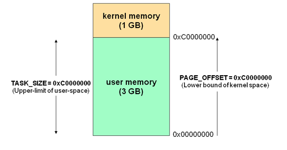
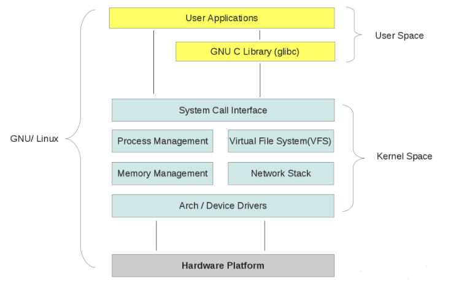

# Linux内核空间，用户空间

用户界面是操作系统的外在表象，内核才是操作系统的内在核心。系统其他部分必须依靠内核这部分软件提供的服务，像管理硬件设备、分配系统资源等。内核有时候被称作是管理者或者是操作系统核心。通常一个内核由负责响应中断的中断服务程序、负责管理多个进程从而分享处理器时间的调度程序，负责管理进程地址空间的内存管理程序和网络、进程间通信等系统服务程序共同组成。对于提供保护机制的现代系统来说，内核独立于普通应用程序，他一般处于系统态，拥有受保护的内存空间和访问硬件设备的所有权限。这种系统态和被保护起来的内存空间，统称为内核空间。相对的，应用程序在用户空间执行。它们只能看到允许它们使用的部分系统资源，并且只使用某些特定的系统功能，不能直接访问硬件，也不能访问内核划给别人的内存范围，还有其他一些使用限制。当内核运行的时候，系统以内核态进入内核空间执行。而执行一个普通用户程序时，系统将以用户态进入用户空间执行。

1. 用户空间、内核空间

   现代操作系统都是采用虚拟存储器，对于32位操作系统，它的逻辑内存（虚拟存储空间）为4G（2^32）。为了保护内核，将其与用户应用程序代码隔离开来，操作系统将逻辑内存划分为两部分，一部分为内核空间，一部分为用户空间。针对linux操作系统而言，将最高的1G字节（从虚拟地址0xC0000000到0xFFFFFFFF），供内核使用；将较低的3G字节（从0x00000000到0xBFFFFFFF）供用户进程使用。每个进程可以通过系统调用进入内核。

   

   内核空间存放linux内核代码和数据，用户空间存放的是用户的程序代码和数据。Linux只使用Intel的Ring0和Ring3两级保护机制（Ring0供内核使用，Ring3供用户空间使用）

   

   **但一个进程执行系统调用而陷入内核代码中执行时，称进程处于内核运行态（内核态）**。此时内核正在代其执行，在这种情况下，进程被称为通过系统调用在内核空间运行，而内核被称为运行于进程上下文中。当进程处于内核态时，执行的内核代码会使用当前进程的内核栈。每个进程都有自己的内核栈。

   **当进程在执行用户程序代码时，则称其处于用户运行态（用户态）**。

2. 进程上下文，中断上下文
   上下文（context）简单来说就是一个环境。对于进程来说就是进程执行时的环境。
   用户空间的程序通过系统调用进入内核空间。这个时候用户空间的进程要传递很多变量、参数给内核，内核态运行的时候也要保存用户进程的一些寄存器的值、变量等。相对于进程而言，具体就是各个变量和数据，包括所有的寄存器变量、进程打开的文件、内存信息等。一个进程的上下文可以分为三个部分：用户级上下文、寄存器上下文以及系统上下文。
   - 用户级上下文：正文、数据、用户堆栈以及共享存储器；
   - 寄存器上下文：通用寄存器、程序寄存器、处理器状态寄存器、栈指针；
   - 系统级上下文：进程控制块（task_struct)、内存管理信息（mm_struct, vm_area_struct, pgd, pte）、内核栈
   当发生进程调度时，进行进程切换就是上下文切换（context switch）。操作系统必须对上面提到的全部信息进行切换，新调度的进程才能运行。而系统调用进行的模式切换（mode switch），模式切换相较于进程切换，容易很多，而且节省时间，因为模式切换最主要的任务时切换进程寄存器。
   
   硬件通过触发信号，导致内核调用中断处理程序，进入内核空间。这个过程中，硬件的一些变量和参数也要传递给内核，内核通多这些参数进行中断处理。所谓中断上下文，其实也可以看作硬件传递过来的参数和内核需要保存的一些环境。中断时，内核不代替任何进程运行，而是执行中断处理，与之没有进程相关联，也就没有进程上下文。内核运行与中断上下文时，不会被阻塞，因为此时没有与之关联的进程上下文，也就没有进程。
   

# References:
Linux内核设计与实现（第三版）
[用户空间与内核空间，进程上下文与中断上下文](<https://www.cnblogs.com/Anker/p/3269106.html>)

