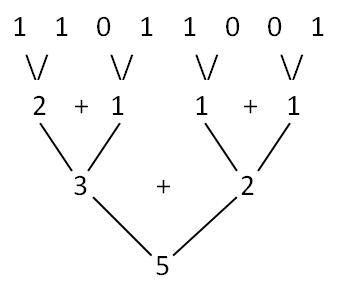

# 二进制数中1的个数

1. naive，一位一位数

   ```c
   unsigned int popcount(unsigned int x) {
       unsigned n = 0;
       for (int i = 0; i < 32; i++) {
           if (x == 0) {
               break;
           }
           n += x & 1;
           x = x >> 1;
       }
       return n;
   }
   ```
   
2. 相对暴力，只数有1的位，复杂度O(有多少个1)

   ```c
   unsigned int popcount(unsigned int x) {
       unsigned n = 0;
       while (x) {
           x = x & (x - 1);
           ++n;
       }
       return n;
   }
   ```

3. 二分法, 复杂度O(log32)
   ```c
unsigned int popcount(unsigned int n) {
       /*
        * swar algorithm, work on 32 bit integer
        */
       n = (n & 0x55555555) + ((n >> 1) & 0x55555555);
       n = (n & 0x33333333) + ((n >> 2) & 0x33333333);
       n = (n & 0x0F0F0F0F) + ((n >> 4) & 0x0F0F0F0F);
       n = (n & 0x00FF00FF) + ((n >> 8) & 0x00FF00FF);
       n = (n & 0x0000FFFF) + ((n >> 16) & 0x0000FFFF);
       return n;
   }
   ```
   
   想法类似二分，两两相加
   
   
   
   将32位数看成相互独立的32个 0-1 数字,
   然后两两相加, 这样我们就有16个数字了,
   然后再两两相加, 就变成8个数字了,
   接着再两两相加变成4个, 
   然后两个, 最后一个数字,
   由于是32位数字的和, 所以答案刚好就是1的个数啦。
   
   ```
   右移 1位. 与数字: 01010101010101010101010101010101 => 0x55555555
   右移 2位. 与数字: 00110011001100110011001100110011 => 0x33333333
   右移 4位. 与数字: 00001111000011110000111100001111 => 0x0F0F0F0F
   右移 8位. 与数字: 00000000111111110000000011111111 => 0x00FF00FF
   右移16位. 与数字: 00000000000000001111111111111111 => 0x0000FFFF
   ```
   
4. 查表，预先算好，查询时直接读

   表的大小可以改，比如256，适当取

   ```c
   #define MAXN 1<<16
   int table[MAXN];
   void pre() {
       for (int i = 1; i < MAXN; i++) {
           table[i] = table[i >> 1] + (i & 1);
       }
   }
   
   unsigned popcount(unsigned x) {
       return (table[x >> 16] + table[x & 0xFFFF]);
   }
   ```

   


## reference

[详解二进制数中1的个数](http://github.tiankonguse.com/blog/2014/11/16/bit-count-more.html)

