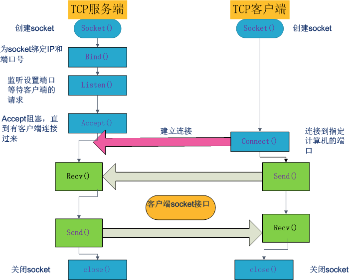

# Socket编程

1. 网络中进程间通信

   进程通信的概念最初来自于单机系统。网络间进程通信要解决的是不同主机进程间的相互通信问题（可把统计进程通信看做是其中的特列）。首先需要解决的是网络间进程标识的问题。同一主机上，不同进程可以用进程号（PID）来区分。但在局域网中，各主机独立分配进程号，不同主机不同基层可能拥有相同的进程号，所以无法用来唯一标识。

   TCP/IP协议族可以解决这个问题，网络层的”ip地址“可以唯一标识网络中的主机，而传输层的”协议+端口号“可以唯一标识主机中的进程。这样一个三元组（IP地址，协议，端口）就可以标识网络的进程了，网络中的进程通信就可以利用这个标识与其他进程交互。

   使用TCP/IP协议的程序通常采用应用编程接口：UNIX BSD的套接字（socket）来实现网络进程之间的通信。

2. 什么是socket

   - socket套接字

     socket起源于Unix，而Unix基本哲学之一就是”一切皆文件“， 都可以用”open -> write/read -> close“模式来操作。socket就是该模式的一个实现。socket即是一种特殊的文件，一些socket函数就是对其进行的操作。

     socket是在应用层与TCP/IP之间的一个软件抽象层次，准确的说，它是一个接口。在设计模式中，socket使用了门面模式（Facade pattern）。它将复杂的TCP/IP协议族隐藏在socket接口后面，对用户来说，一组简单的接口就是全部，让socket去组织数据。
     
     
     
     
     
     

3. 客户端/服务器socket通信简单例子

   ```python3
#!/usr/bin/env python3
   # 客户端
import socket
   

   # create socket descriptor
client = socket.socket(socket.AF_INET, socket.SOCK_STREAM)
   # connect with local loopback address
client.connect(('127.0.0.1', 9999))
   
   # receive message from server, and send message from console input
   # close the socket until input 'exit'
   while True:
   	data = client.recv(1024)
   	print(data.decode('utf-8'))
   	
   	msg = input('>>> ')
   	client.send(msg.encode('utf-8'))
   	if msg == 'exit':
   		break
   client.close()
   ```
   
   ```python3
   #!/usr/bin/env python3
   # 服务器端
   import socket
   import time
   import random
   
   
   s = socket.socket(socket.AF_INET, socket.SOCK_STREAM)
   s.bind(('127.0.0.1', 9999))
   s.listen(5)  # backlog number
   print('Waiting for connection...')
   
   # accept connection from client
   # receive message from client and send a random integer back 
   # until receive 'exit', close the connection and wait for next one
   while True:
   	conn, addr = s.accept()
   	conn.send(b'Welcome')
   	print('Connected with %s:%s' % addr)
   	while True:
   		data = conn.recv(1024)
   		time.sleep(1)  # simple way to unpack block
   		if not data or data.encode('utf-8') == 'exit':
   			break
   		else:
   			msg = random.randint(1, 100)
   			conn.send(str(msg).encode('utf-8'))
   	conn.close()
   	print('Connection from %s:%s closed\n' % addr)
   ```
   
   
   
4. Python socket编程

   a. 创建socket描述符

   `socket.socket(address_family, socket_type, protocol)`

   `address_family`选择协议族（都以AF_开头），决定地址格式。`socket_type`确定套接字的类型。`protocol`指定协议。

   b. 链接`connect()`

   c. 监听`bind()`

   `accept()`

   d. 接受`recv()` `recvfrom()` 

   e. 发送 `send()`  `sendto()`

5. Unix/linux下网络处理多连接

   解决多客户‘并发’的方式：

   a. 多线程

   每当有客户端连接，启动一个线程来处理客户端数据

   b. 异步I/O

   ```asyncio```库使用单线程来处理多任务, 使用事件循环来管理任务

   c. I/O复用，同步非阻塞监听

   先来理解下复用这个概念，复用也就是共用的意思。比较形象的解释，先看在通信领域中的使用，在通信领域中为了充分利用网络连接的物理介质，往往在同一条网络链路上采用时分复用或者频分复用的技术使其在同一链路上传输多路信号。对于网络编程来说，客户端发来的请求服务端会产生一个进程来对其服务，每当来一个客户请求就产生一个进程来服务，然而进程不可能无限制的产生，因此为了解决大量客户端访问的问题，引入了I/O复用技术：一个进程可以同时对多个客户请求进行服务。也就是说I/O复用的介质是进程，复用一个进程来对多个I/O进行服务，虽然客户端发来的I/O是并发的，但是I/O所需的读写数据多数情况下是没有准备好的，因此就可以利用`select`或者`poll` 来监听I/O所需的这些数据的状态，一旦I/O有数据可以进行读写了，进程就来对这样的I/O进行服务。

   

   `引用自Operating System Concpet - Abraham Silberschatz`

   *"To support the implementation of servers, the socket interface also provides a function called `select()` that manages a set of sockets. A call to `select()` returns information about which sockets have a packet waiting to be received and which sockets have room to accept a packet to be sent. The use of `select()` eliminates the polling and busy waiting that would otherwise be necessary for network I/O.''*

   假设一个进程同时见识多个设备，如果`read(设备1)` 是阻塞的，那么只要设备1没有数据到达，就会一直阻

   塞在设备1的read调用上，即使设备2有数据到达也不能处理，使用非阻塞I/O就可以避免设备2得不到及时处理。

   非阻塞I/O有一个缺点，如果所有设备都一直没有数据到达，调用者需要反复查询做无用功，如果阻塞在那里系统可以调度执行其他进程，就不会做无用功了。`select()` 函数可以阻塞地同时监视多个设备，还可以设定阻塞等待的超市时间，从而解决了这个问题。

   python标准库提供I/O多路复用模块，包括基础的`select` 模块和高层的`selectors` 模块

6. 附录

   - 进程的阻塞：

   正在执行的进程，由于期待的某些事件未发生，如请求系统资源失败、等待某种操作的完成、新数据尚未到达或无新工作做等，则由系统自动执行阻塞原语（Block），使自己由运行状态变为阻塞状态。当进程调用一个阻塞（Block）的系统函数时，该进程被置于睡眠状态，这时内核调度其他进程运行，直到该进程等待的事件发生了（比如网络上接收到数据包，或者调用sleep制定的睡眠时间到了）它才有可能继续运行。与睡眠状态相对的是运行状态，在linux内核中处于运行状态的进程分为两种情况：正在被调用执行和就绪状态。
   
   
   
   - Unix/Linux下可用的5种I/O模型：
     - 阻塞I/O
     - 非阻塞I/O
     - I/O多路复用 (select, poll)
     - 信号驱动I/O (SIGIO)
     - 异步I/O
   
7. 

    

   

Reference：

[1] [Linux的SOCKET编程详解](<https://www.cnblogs.com/jiangzhaowei/p/8261174.html>)

[2] [Python——Socket编程](<https://www.jianshu.com/p/4d0fab3fed16?utm_campaign=maleskine&utm_content=note&utm_medium=seo_notes&utm_source=recommendation>)

[3] [Python Socket编程](<https://www.jianshu.com/p/9207700ec26d>)

[4] [Python中的Socket编程](<https://keelii.gitbooks.io/socket-programming-in-python-cn/content/>)

[5] [Linux IO模式及select, poll, epoll详解](<https://segmentfault.com/a/1190000003063859#articleHeader6>)